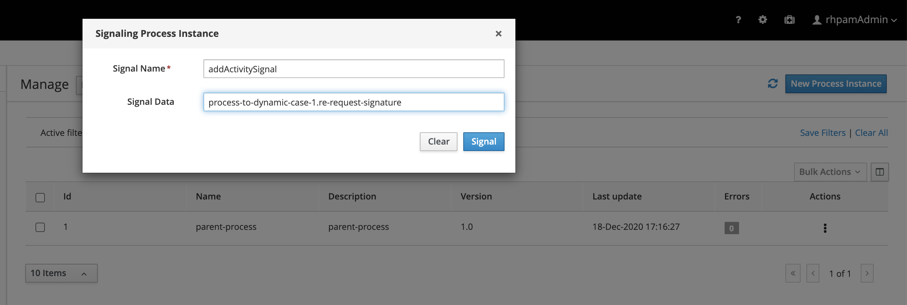
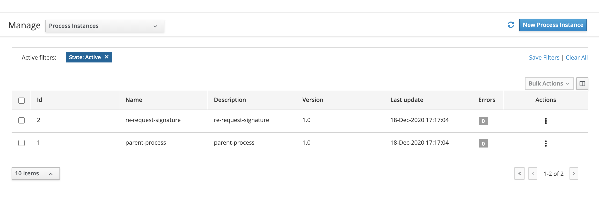
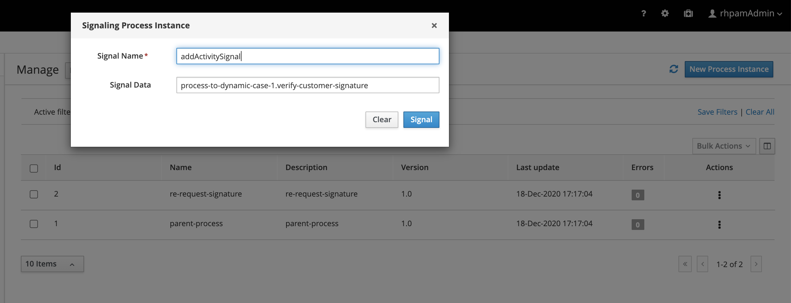
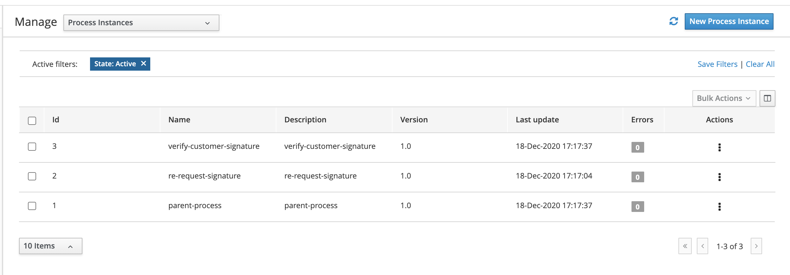

Case Instances from process and it's Life cycle
=================================================

This exmaple provides inforamtion about, how to create dynamic case instances from the process.

In this example we are using start case to start the other cases dynamically.

Post deploying the kJar follow the the below steps.

* Step 1: Create a process instance for [parent-process]()
* Step 2: Signal created case instance with signal name and dyncamic case id as data to signal

* Step 3: Now observe the newly created case instance.

* Step 4: Repeat the step 2 for all other case type processes.

